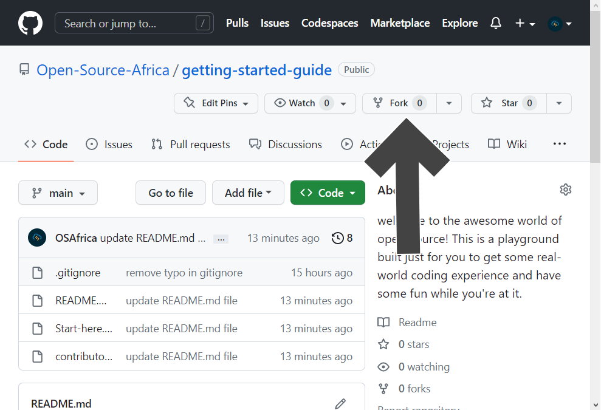
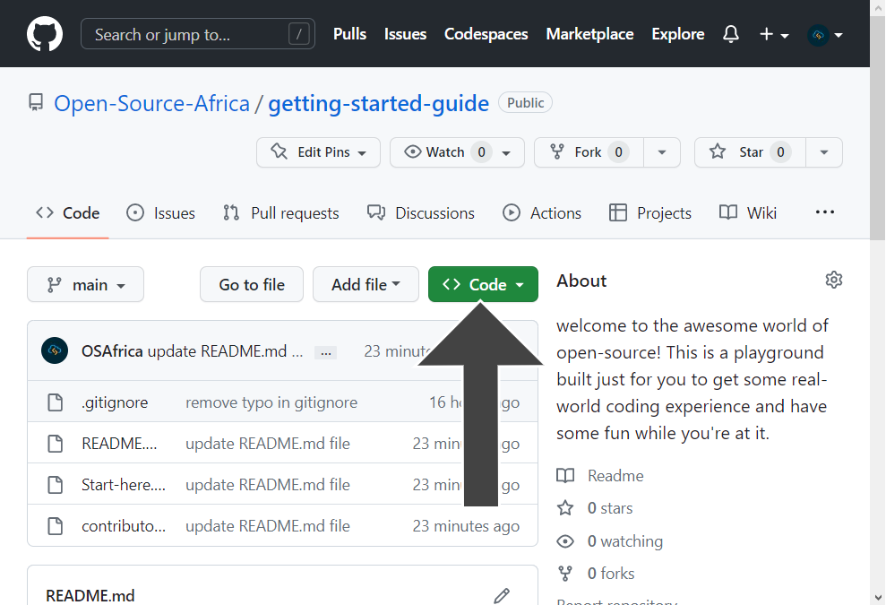

# Getting Started.

Hey there! Welcome to the community! While it may seem daunting to get started, especially if you're new to coding or contributing to open-source, don't worry! We understand that learning new technologies and collaborating with others can be a challenge, but it's also an incredibly rewarding experience that can benefit you in many ways.

Even though it might be tough to jump in at first, remember that you're not alone in this journey. With some effort and a positive attitude, you'll soon find yourself thriving in this exciting and welcoming community. So come on in, join the fun, and let's create something amazing together!
## A beginner's guide on how to contribute.

1. Go to the ```'Start-here.md'``` file in this directory for a brief introduction to open source and its significance

2. Click the ```'Fork'``` button on the [GitHub page of this repository](https://github.com/Open-Source-Africa/getting-started-guide).



3. Create a local copy of your forked repository by ```cloning``` it to your computer.



For example, enter this command in your terminal:

```bash
git clone https://github.com/<your-github-username>/getting-started-guide.git
```
**Note:** Change ```<your-github-username>```

>Find out additional information on [how to fork](https://help.github.com/en/github/getting-started-with-github/fork-a-repo) and [cloning a repository](https://docs.github.com/en/github/creating-cloning-and-archiving-repositories/cloning-a-repository).

4. Navigate to the project directory:

```bash
   cd getting-started-guide
   ```
5. To prevent merge conflicts, synchronize your fork before making any modifications:

```bash
git remote add upstream https://github.com/Open-Source-Africa/getting-started-guide.git
git pull upstream main
```

**Note:** This is a space for experimentation, and we promote taking risks and learning from failures. Utilize this environment as a platform for practice and relish collaborating with others on projects that you create together. A large number of folks have attained practical know-how on "teamwork" by participating in such initiatives.